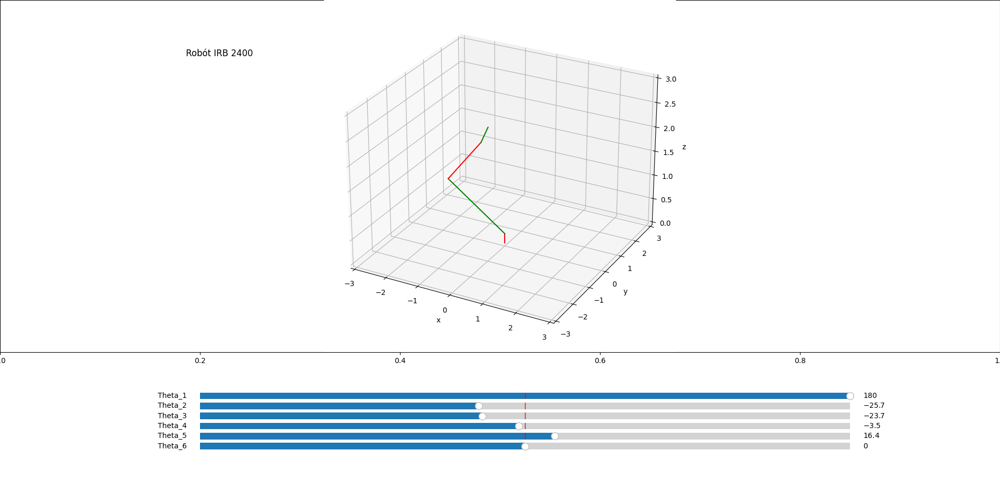

# ABB IRB 2400

Motion simulation of a ABB IRB 2400 Robot using direct kinematics. 6 DOF can be manipulated.

## Requirements

This module requires the following modules:
- [Numpy](https://numpy.org/)
- [Matplotlib](https://matplotlib.org/)